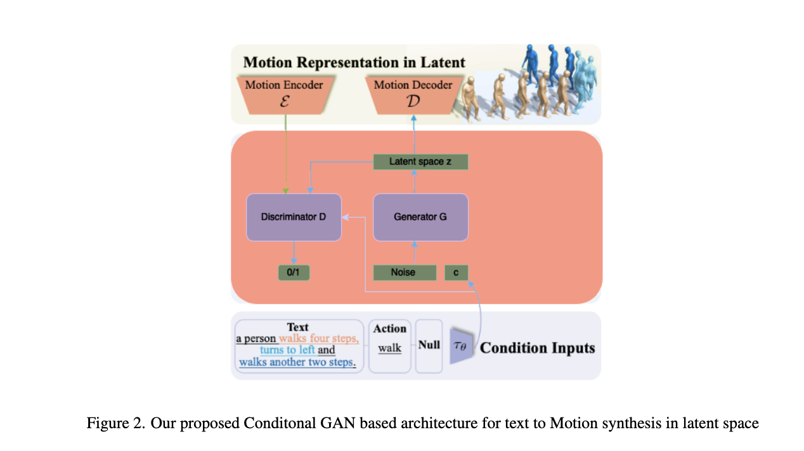
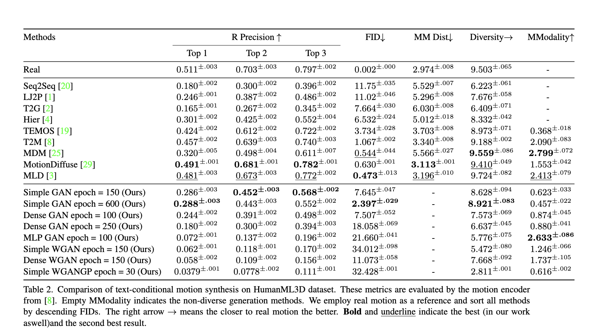
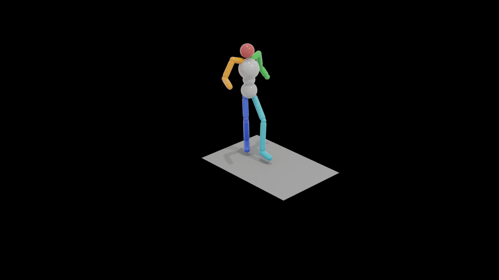
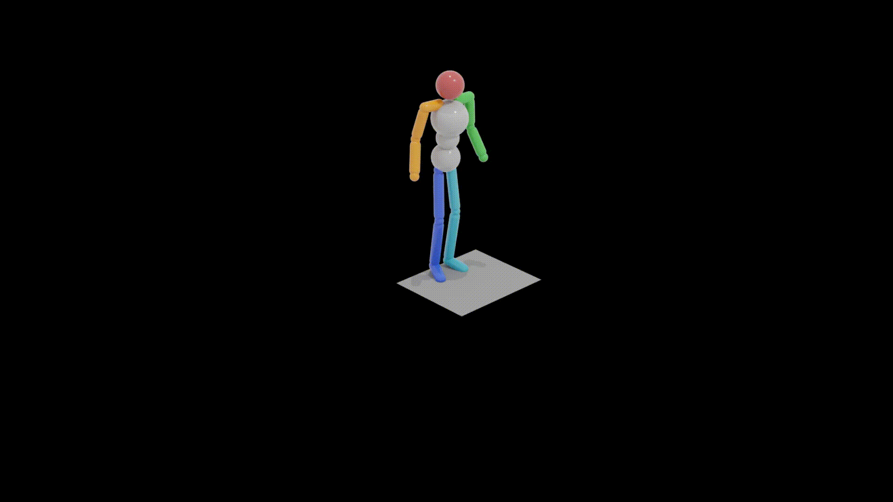
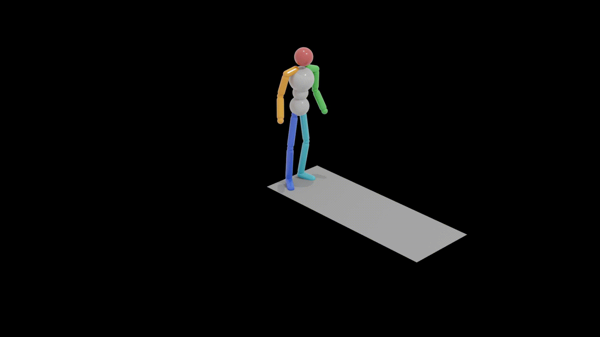

# Exploring Human Motion Synthesis with Latent-Space GANs

This repo is for the CS674 final project tackling motion synthesis

Human motion synthesis conditioned on textual inputs has gained significant attention in recent years due to its potential applications in various domains such as gaming, film production, and virtual reality. Conditioned Motion synthesis takes a text input and output a 3D motion corresponding to the text. While previous works have explored motion synthesis using raw motion data and latent space representations with diffusion models, these approaches often suffer from high training and inference times. 

In this project, we introduce a novel framework that utilizes Generative Adversarial Networks (GANs) in the latent space to enable faster training and inference while achieving comparable results to state-of-the-art methods. We conduct experiments on the HumanML3D benchmark and demonstrate that a simple GAN architecture with three linear layers in the latent space achieves an **FID of 2.39 and a diversity score of 8.92.** Our work opens up new possibilities for efficient and high-quality human motion synthesis using latent space GANs.

This work explores the use of latent space in motion synthesis to enhance the performance of various architectures in low resource setting. While diffusion models deliver state-of-the-art results, they are data-intensive and costly to train. By leveraging latent space, this project aims to improve the performance of models with simpler architectures. The exploration begins with basic generator and discriminator architectures, then expands to include residual connections and elements from StyleGAN to better predict the latent space representation of motion sequences. The VAE architecture is based on [MLD](https://github.com/ChenFengYe/motion-latent-diffusion), utilizing a transformer model as the Encoder and Decoder with skip connections.

## Proposed framework architecture

## Model architectures studied
- **Simple GAN**: This is a simple Generator with 3 Linear layers that maps the noise, conditioned text embeddings to a motion latent space, and the discriminator with 4 linear layers followed by a sigmoid activation maps the motion latent space, conditioned text embedding to binary value.
- **Dense GAN**: Two residual blocks (with 1D convolutions) added in between two linear layers into the Generator and discriminator architectures to tackle the vanishing gradient problem.
- **MLP GAN**: Components from StyleGAN were adapted to generate motion latent space, starting with the mapping network and experimenting with a 3-layer Adaptive Instance Normalization and Noise layers. nitial experiments with noise layers led to high FID scores, but removing these layers improved performance. The final architecture uses only the mapping network (MLP) for the generator and a simple 3-layer discriminator to predict real or fake motion sequences.
- **Wasserstein GAN**: To improve the qualitative and quantitative metrics, we implemented the Wasserstein GAN - GP architecture. WGAN-GP by design tries to reduce the Wasserstein distance between the distribution of real and fake data. Models based on this architecture have been shown better generational capabilities and do not suffer from the same training instabilities that the traditional GAN does.

## Results

## Output

Following motion previews are from our best model which generates a motion given a text prompt.

  

    
    
a man kicks something with his left leg

  

  

    
    
a person is skipping rope

  

  

    
    
a person walks backward slowly

  

